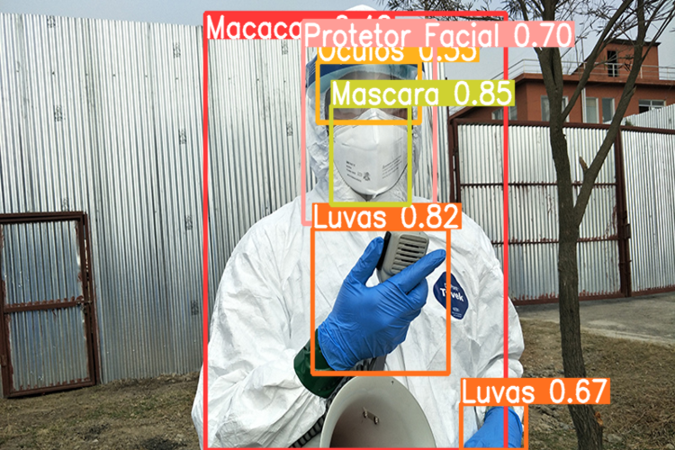

# Demo Detecção de EPIs

> Projeto de Demonstração de Detecção de EPIs Médicas em Imagens e em Vídeo

### Objetivo do Projeto

O objetivo do projeto consiste em desenvolver um sistema que detecte automaticamente o uso de EPIs (Equipamentos de Proteção Individual) em vídeo utilizando tecnologias do estado da arte da Visão Computacional. Desse modo, como parte inicial do projeto foi feita uma demonstração da capacidade das Redes Neurais Convolucionais para resolver problemas relativos à detecção de objetos em vídeo através da arquitetura de rede YOLO.

### Demonstração da Capacidade da Rede

||||
|-|-|-|

### Métricas Avaliativas

|Classe|Imagens|Rótulos|Acurácia (%)|Precisão (%)|Sensibilidade (%)|
|-|-|-|-|-|-|
|Macacão|29|45|83,70|99,00|72,10|
|Protetor Facial|29|17|89,00|86,80|76,50|
|Luvas|29|61|79,20|83,30|70,50|
|Óculos|29|32|73,50|76,20|65,60|
|Máscara|29|52|88,00|92,20|84,60|
|Todas as Classes|29|207|82,70|87,70|73,90|

|||
|-|-|

|||
|-|-|